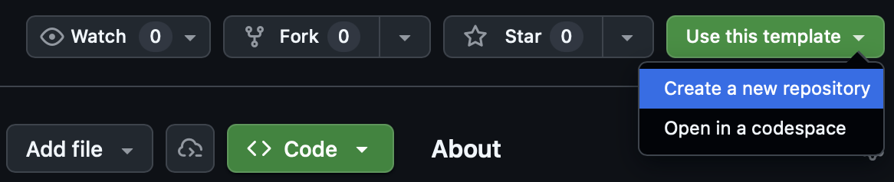

## Overview

**This guide walks through the HRL workflow for publishing a dataset to the** [**Environmental Data Initiative (EDI)**](https://edirepository.org/) **data repository.** EDI hosts ecological and environmental datasets and makes them publicly findable and reusable through standardized metadata and retrieval tools. This guide is for publishing standard flat files where variable names are columns and observations are rows. You are able to publish multiple data tables within one EDI package.

The workflow aligns with [FAIR principles](../principles/fair-care.qmd). EDI achieves this through a metadata standard called **EML (Ecological Metadata Language)**, an XML format that documents who collected the data, where, when, how, and under what rights.

The [example](https://github.com/lucy-dwr/edi-hrl-pub-example) used throughout this guide is a dataset of fish microhabitat observations from the Feather River, collected by the California Department of Water Resources (DWR) and published as part of the Healthy Rivers and Landscapes Science Program. 

::: {.callout-warning title="Publication exceptions"}
HRL Data Producers are expected to publish most datasets to EDI. However, very large or complex datasets—such as high-resolution imagery collections, climate model outputs, or large geospatial files—may exceed EDI’s size and storage constraints or be ill-suited for the platform. These datasets will be hosted and published by the Central Data Team using HRL program infrastructure, with EDI metadata records and landing pages cross-linking to the hosted assets when appropriate.
:::

---

### Pipeline at a glance

The publication workflow has four stages that run in order:

```{mermaid}
flowchart LR
  ingest["<code>ingest/</code><br/>ingest data"] --> clean["<code>clean/</code><br/>clean data"]
  clean --> qc["<code>qc/</code><br/>quality control"]
  qc --> publish["<code>publish/</code><br/>publish to EDI"]

  classDef data fill:#eef5ee,stroke:#6f8f72,stroke-width:2px,color:#2f3b30;
  classDef review fill:#f5f3ee,stroke:#8a8173,stroke-width:2px,color:#3b3832;
  classDef release fill:#edf3f7,stroke:#607d8b,stroke-width:2px,color:#26343a;
  class ingest,clean data;
  class qc review;
  class publish release;
  linkStyle default stroke:#4a4a4a,stroke-width:2px;
```

::: {.workflow-table}
| Stage | Folder | What it does |
|-------|--------|--------------|
| **Ingest** | `ingest/` | Pulls raw data from APIs or file sources into `data/raw/` |
| **Clean** | `clean/` | Standardizes and fixes raw data; writes to `data/clean/` |
| **QC** | `qc/` | Validates cleaned data and flags suspect records |
| **Publish** | `publish/` | Generates EML metadata and submits to EDI |
:::

---

## How to use this guide

There are two HRL repositories referenced in this guide:

- **Use the** [**HRL EDI template repository**](https://github.com/FlowWest/hrl-edi-template) **to start a new dataset publication.** This is the blank working repository that Data Producers copy, rename, and adapt for their own dataset.
- **Use the** [**EDI HRL publication example**](https://github.com/lucy-dwr/edi-hrl-pub-example) **to see how the workflow is implemented for an example dataset.** This repository is a tutorial and should be used as a reference, not as the starting point for a new publication.

The primary path through this guide is to create your own publication repository from the template, then adapt each stage for your dataset. The worked example provides concrete script and metadata examples that you can compare against while filling in the template.

### Create your publication repository

1. Open the [HRL EDI template repository](https://github.com/FlowWest/hrl-edi-template).
2. Select **"Use this template"** and then **"Create a new repository"**.
3. Name the new repository for the dataset or publication.
4. Clone the new repository to your computer.

{fig-alt="GitHub Use this template menu with Create a new repository selected." width="70%"}

After creating the new repository on GitHub, clone it locally using your IDE or the commands below:

```bash
git clone https://github.com/<organization>/<new-repository-name>.git
cd <new-repository-name>
```

::: {.callout-note title="Using the worked example"}
You do not need to clone the example repository to use the template. If you want to inspect or run the example locally, clone it separately with `git clone https://github.com/lucy-dwr/edi-hrl-pub-example.git`.
:::

---

## Prerequisites

### Local tools and accounts

Before starting, confirm that you have:

- A [GitHub](https://github.com/) account with permission to create or access the publication repository
- [Git](https://git-scm.com/) installed locally, or an IDE that can clone GitHub repositories
- [R](https://cran.r-project.org/) installed
- An R-capable IDE, such as [RStudio](https://posit.co/download/rstudio-desktop/) or [Positron](https://positron.posit.co/)
- Access to the [HRL EDI template repository](https://github.com/FlowWest/hrl-edi-template)
- An [EDI account](https://portal.edirepository.org/nis/login.jsp) for staging and production publication

### Install packages

The template and example repositories use [`{renv}`](https://rstudio.github.io/renv/) to lock package versions, so anyone who clones the repository gets a consistent R environment.

After cloning your new publication repository from the template, run the setup script from the project root:

```r
source("scripts/setup.R")
```

The setup script installs `{renv}` if needed and runs `renv::restore()`, which installs required packages into a project-local library without touching your system-wide R packages. The template setup script is available at [`scripts/setup.R`](https://github.com/FlowWest/hrl-edi-template/blob/main/scripts/setup.R). Key packages used are:

- **`{hrlpub}`** — HRL's internal package wrapping `{EMLassemblyline}` for metadata generation and EDI submission
- **`{EMLassemblyline}`** — assembles EML XML from template files
- **`{readr}`, `{dplyr}`, `{stringr}`, `{lubridate}`** — tidyverse packages for data cleaning

## Before you start

Before investing time in the publication workflow, confirm that the dataset is ready for publication on EDI as a static, version-controlled data package:

1. Confirm that the dataset is approved for public release through the appropriate HRL project or agency review process.
2. Confirm that EDI is the right repository for the dataset. If the dataset is very large, geospatially complex, or otherwise poorly suited to EDI, coordinate with the Central Data Team before proceeding.
3. Identify the raw source files or data systems that will be used for raw data ingestion.
4. Gather metadata inputs, including dataset title, abstract, methods, personnel, spatial coverage, temporal coverage, keywords, units, taxonomic coverage if relevant, and intellectual rights. See [Fill in metadata templates](#fill-in-metadata-templates) for the full list of metadata files used in this workflow.
5. Identify reviewers for cleaned data, quality control outputs, metadata, EDI staging, and production publication.

Use the EDI data package ID `edi.000.1` while developing locally. Reserve and apply a real EDI package number only when the package is ready for staging submission.

---

## Repository structure

```bash
project/
├── data/
│   ├── raw/             # raw, untouched data — never edited by hand
│   └── clean/           # cleaned data and diagnostic outputs generated with scripts
├── ingest/              # scripts to pull data from APIs or downloads
├── clean/               # cleaning scripts
├── qc/                  # quality control scripts
├── publish/
│   ├── metadata/        # metadata template files (you fill these in)
│   │   └── attributes/  # column-level attribute definitions (one CSV per table)
│   ├── eml/             # generated EML XML output
│   ├── make-eml.R       # generates the EML file
│   └── publish.R        # scripts to submit to EDI (disabled by default)
└── scripts/
    ├── setup.R          # restores the {renv} environment
    └── run_pipeline.R   # runs all four stages in sequence
```

For iterative work, you may also orchestrate the workflow with [`{targets}`](https://books.ropensci.org/targets/). A `{targets}` pipeline defines ingest, clean, QC, and publish as an explicit dependency graph, so only the stages affected by a change are re-run. In the worked example, [`_targets.R`](https://github.com/lucy-dwr/edi-hrl-pub-example/blob/main/_targets.R) defines four targets:

```r
raw_outputs     <- run_ingest()
clean_outputs   <- run_clean(raw_outputs)
qc_outputs      <- run_qc(clean_outputs)
publish_outputs <- run_publish(clean_outputs, qc_outputs)
```

This pattern is most useful once you are iterating on a real dataset. For example, if you change the QC code, `{targets}` can re-run QC and any dependent publication metadata generation without repeating unchanged upstream work.

Each stage folder contains two scripts:

- A **tutorial script** (e.g., `clean/clean-microhabitat-observations.R`) — step-by-step, with detailed comments; read and run this interactively when learning.
- A **runner function** (e.g., `clean/clean.R`) — exposes `run_clean()` for use by the pipeline runner or `{targets}`.

---

## Step 1: Ingest {#ingest}

**Template script:** `ingest/read-data.R`  
**Example script:** [`ingest/read-data-cdec.R`](https://github.com/lucy-dwr/edi-hrl-pub-example/blob/main/ingest/read-data-cdec.R)

The ingest step gets raw data into `data/raw/`. In your publication repository, use this step to either place a static raw file in `data/raw/` or write a script that downloads or exports raw data from another system. Raw files should be treated as source inputs: do not edit them by hand after they are added.

In the template repository, `ingest/read-data.R` is a placeholder. Replace it with dataset-specific code that:

1. Identifies the raw data source, such as a field data export, agency database export, API, or manual file transfer.
2. Writes raw outputs to `data/raw/` using clear, stable filenames.
3. Preserves raw data as received, with any cleaning or standardization deferred to [Step 2: Clean](#clean).
4. Returns or prints the path to each raw file created or validated so later pipeline steps know what was produced.

### Ingest output formats

Keep raw data in the format in which they are received when that format is useful for provenance, such as `.csv`, `.xlsx`, `.txt`, database exports, or instrument files. For data pulled from an API or another R workflow, `.rds` is acceptable as an intermediate raw capture because it preserves R object types such as dates and factors. The worked example writes CDEC API output to `data/raw/oroville_precip_2024_raw.rds` for this reason.

Publication-ready data tables should be written later in the workflow, after cleaning and quality control, using open tabular formats such as `.csv`.

For static files, this may be as simple as placing the file in `data/raw/` and adding a short script that checks it exists:

```r
raw_file <- "data/raw/my_dataset_raw.csv"

if (!file.exists(raw_file)) {
  stop("Missing raw input file: ", raw_file, call. = FALSE)
}

raw_file
```

For data downloaded from an API or database, write the ingest script so it can be re-run and produce the same expected raw output object. The example fetches 2024 precipitation data from the [CDEC API](https://cdec.water.ca.gov) using the `{cder}` package.

Two important design patterns from the example are:

**Retry logic.** Public APIs can fail transiently. Wrapping the call in a retry loop avoids requiring manual re-runs. The exact API call will differ by dataset, but the basic pattern is:

```r
fetch_with_retry <- function(fetch_data, max_attempts = 3, wait_seconds = 5) {
  for (attempt in seq_len(max_attempts)) {
    result <- tryCatch(fetch_data(), error = identity)

    if (!inherits(result, "error")) {
      return(result)
    }

    if (attempt < max_attempts) {
      Sys.sleep(wait_seconds)
    }
  }

  stop("Unable to fetch data after retries.", call. = FALSE)
}
```

**Idempotent downloads.** Re-running the script skips the download when output already exists, saving time and avoiding unnecessary API calls. Here is an example of a simple idempotent download pattern:

```r
if (file.exists(output_file) && !isTRUE(overwrite)) {
  message("Skipping download; output already exists: ", output_file)
  return(output_file)
}
```

**Output:** `data/raw/oroville_precip_2024_raw.rds`

::: {.callout-note title="Example raw data"}
Raw data for the microhabitat dataset (`data/raw/microhabitat_observations_raw.csv`) is included directly in the repository because it was provided as a static file rather than an API. For most datasets you'll either include a static file or write an ingest script like this one.
:::

---

## Step 2: Clean {#clean}

**Template script:** `clean/clean-data.R`  
**Example script:** [`clean/clean-microhabitat-observations.R`](https://github.com/lucy-dwr/edi-hrl-pub-example/blob/main/clean/clean-microhabitat-observations.R)

The cleaning step reads raw data from `data/raw/`, applies dataset-specific standardization and correction rules, and writes cleaned outputs to `data/clean/`. Cleaning is where raw source inputs become analysis- and publication-ready tables, but before final quality control flags are assigned.

In the template repository, `clean/clean-data.R` is a placeholder. Replace it with dataset-specific code that:

1. Reads the raw file or files created or validated during [Step 1: Ingest](#ingest).
2. Applies transparent, scripted transformations such as renaming fields, parsing dates, standardizing units, harmonizing controlled vocabularies, and handling known invalid values.
3. Preserves enough diagnostic information to explain what changed and why.
4. Writes cleaned data and cleaning diagnostics to `data/clean/`.

The worked example writes `data/clean/microhabitat_observations_clean.csv`, a cleaning issue summary, and several diagnostic files. Three common cleaning patterns from the example are:

### Date parsing

Raw date fields often contain multiple formats across rows. The example script profiles all format variants before parsing:

```r
raw <- raw |>
  dplyr::mutate(
    date_format_raw = dplyr::case_when(
      stringr::str_detect(date, "^\\d{4}-\\d{2}-\\d{2}$") ~ "yyyy-mm-dd",
      stringr::str_detect(date, "^\\d{2}/\\d{2}/\\d{4}$") ~ "mm/dd/yyyy",
      stringr::str_detect(date, "^\\d{2}-\\d{2}-\\d{4}$") ~ "dd-mm-yyyy",
      is.na(date)                                         ~ "missing",
      TRUE                                                ~ "other"
    )
  )
```

Dates are then parsed with multiple format fallbacks using `lubridate::parse_date_time()`. Rows that fail to parse are left as `NA` and logged.

### Negative value and percent range checks

[`hrlpub::run_clean_checks()`](https://flowwest.github.io/hrlpub/reference/run_clean_checks.html) scans declared numeric columns for values that should never be negative (e.g., fish count, depth) and flags percent columns outside the 0–100 range. Negative values are set to `NA`:

```r
negative_cols <- c("count", "fl_mm", "dist_to_bottom", "depth",
                   "focal_velocity", "velocity")

clean_checks <- hrlpub::run_clean_checks(
  data = raw,
  dataset_name = "microhabitat",
  negative_cols = negative_cols,
  percent_cols = percent_cols
)

raw <- raw |>
  dplyr::mutate(
    dplyr::across(dplyr::all_of(negative_cols),
                  ~ replace(.x, !is.na(.x) & .x < 0, NA))
  )
```

### Controlled vocabulary standardization

Species names and geomorphic unit labels are standardized to a controlled vocabulary. A lookup table maps known misspellings and variants to their canonical forms:

```r
species_map <- tibble::tribble(
  ~raw_value,                    ~clean_value,
  "chinok salmon",              "chinook salmon",
  "steelhead trout (wlid)",     "steelhead trout (wild)",
  "steelhead trout, (clipped)", "steelhead trout (clipped)",
  "steelhed trout (wild)",      "steelhead trout (wild)",
  # ... etc.
)

raw <- raw |>
  dplyr::mutate(species_norm = species |>
    stringr::str_replace_all(",", "") |>
    stringr::str_squish() |>
    stringr::str_to_lower()) |>
  dplyr::left_join(species_map, by = c("species_norm" = "raw_value")) |>
  dplyr::mutate(species = dplyr::coalesce(clean_value, species_norm))
```

Values that don't match the controlled vocabulary after normalization are set to `NA` and logged as unrecognized.

### Dataset-specific cleaning

Some datasets will require additional cleaning that is not covered by the standard checks. This may include reconciling site names, joining lookup tables, converting legacy codes, splitting or combining fields, removing duplicate records, or applying project-specific rules for known data-entry problems. These decisions should be scripted, narrowly scoped, and documented in the issue log or supporting diagnostics.

When adding dataset-specific cleaning, avoid changing raw inputs directly. Keep the raw value where it is useful for traceability, create a cleaned value or replacement field, and record the rule used to make the change.

### Logging cleaning issues

After cleaning, record what was changed, how many rows were affected, and where reviewers can find supporting details. The [`hrlpub::log_issue()`](https://flowwest.github.io/hrlpub/reference/log_issue.html) helper creates standardized issue-log rows that can be combined and written to an issue summary file.

```r
issue_log <- tibble::tibble()

date_parse_failures <- raw |>
  dplyr::filter(!is.na(date_original), is.na(date))

issue_log <- dplyr::bind_rows(
  issue_log,
  hrlpub::log_issue(
    issue = "date_parse_failed",
    rows_affected = nrow(date_parse_failures),
    action = "Parsed with ymd/mdy/dmy; unparsable values set to NA",
    n_total = nrow(raw),
    details_path = "data/clean/diagnostics/date_parse_failures.csv"
  )
)
```

Write the issue log with the cleaned data so reviewers can trace major transformations and known data limitations:

```r
readr::write_csv(issue_log, "data/clean/my_dataset_issue_summary.csv")
```

### Clean output formats

Cleaned data should be written in an open tabular format, usually `.csv`, because these files are the likely inputs to publication metadata and EDI submission. Use clear filenames that distinguish cleaned outputs from raw inputs, such as `my_dataset_clean.csv`.

Diagnostic outputs should also be written to `data/clean/` or `data/clean/diagnostics/`. These may include issue summaries, parse-failure reports, lists of values standardized to controlled vocabularies, or other files that help reviewers understand how raw data were transformed.

At minimum, a cleaning script should write the cleaned dataset and document issues observed in the data. A suggestion for doing this is:

```r
clean_file <- "data/clean/my_dataset_clean.csv"
issues_file <- "data/clean/my_dataset_issue_summary.csv"

dir.create("data/clean", showWarnings = FALSE, recursive = TRUE)

readr::write_csv(clean_data, clean_file)
readr::write_csv(issue_log, issues_file)
```

### Outputs

Here is one option for how to structure cleaning outputs, as presented in the example repository:

```bash
data/clean/
├── microhabitat_observations_clean.csv          # the cleaned dataset
├── microhabitat_observations_issue_summary.csv  # summary of all issues found
└── diagnostics/
    ├── microhabitat_date_format_counts.csv
    ├── microhabitat_date_parse_failures.csv
    ├── microhabitat_species_standardized_details.csv
    ├── microhabitat_species_missing_or_unrecognized.csv
    ├── microhabitat_channel_standardized_details.csv
    └── microhabitat_channel_missing_or_unrecognized.csv
```

---

## Step 3: Quality Control {#qc}

**Template script:** `qc/qc-data.R`  
**Example script:** [`qc/qc-microhabitat-observations.R`](https://github.com/lucy-dwr/edi-hrl-pub-example/blob/main/qc/qc-microhabitat-observations.R)

The quality control step validates the cleaned data created in [Step 2: Clean](#clean). Cleaning applies known corrections and standardization rules; quality control evaluates the cleaned dataset for remaining values that are unusual, outside expected ranges, or likely to need review before publication.

In the template repository, `qc/qc-data.R` is a placeholder. Replace it with dataset-specific code that:

1. Reads the cleaned data table from `data/clean/`.
2. Runs standard checks that apply to the data type, such as fish observations, water quality, habitat, chemistry, or other HRL data products.
3. Adds dataset-specific quality control checks where needed, such as expected site/date combinations, allowable categorical values, duplicate records, or biologically implausible values.
4. Writes quality control flags, summary counts, and a quality control issue summary to `data/clean/` or `data/clean/diagnostics/`.

### Quality control flags

Quality control checks should distinguish records that pass from records that need review. The worked example assigns each row a flag:

::: {.workflow-table}
| Flag | Meaning |
|------|---------|
| `PASS` | Record meets QC criteria |
| `SUSPECT` | Record is unusual but may be valid |
| `REJECT` | Record likely contains an error |
:::

Review `SUSPECT` and `REJECT` records before proceeding to publication. These records should be corrected when there is a documented basis for correction, retained with explanation when valid, or excluded from publication when they are not usable.

### Standard quality control checks

The [`hrlpub::run_qc_checks()`](https://flowwest.github.io/hrlpub/reference/run_qc_checks.html) helper applies standard quality control checks for supported HRL data types. In the worked example, the cleaned microhabitat data are checked as `fish_observation` records:

```r
qc_results <- hrlpub::run_qc_checks(
  data = qc_data,
  data_type = "fish_observation",
  max_count = 1000
)
```

`hrlpub::run_qc_checks()` returns flag-level outputs that can be summarized and written as review artifacts. Use the supported `data_type` value that best matches your dataset; see the [`hrlpub::run_qc_checks()` reference](https://flowwest.github.io/hrlpub/reference/run_qc_checks.html) for currently supported options. Add dataset-specific checks when the standard helper does not cover an important publication rule.

### Quality control reports and issue logging

The [`hrlpub::generate_qc_report()`](https://flowwest.github.io/hrlpub/reference/generate_qc_report.html) helper writes an RDS report object that can be used for review or downstream summaries:

```r
qc_report <- hrlpub::generate_qc_report(
  qc_results = qc_results,
  output_file = "data/clean/diagnostics/my_dataset_qc_report.rds"
)
```

As in the cleaning step, use [`hrlpub::log_issue()`](https://flowwest.github.io/hrlpub/reference/log_issue.html) to summarize quality control outcomes in an issue file:

```r
qc_flags <- qc_results$flags
n_suspect <- sum(qc_flags$flag == "SUSPECT", na.rm = TRUE)

qc_issue_log <- hrlpub::log_issue(
  issue = "qc_suspect_records",
  rows_affected = n_suspect,
  action = "Flagged as SUSPECT by hrlpub::run_qc_checks",
  n_total = nrow(qc_data),
  details_path = "data/clean/diagnostics/my_dataset_qc_flags.csv"
)
```

### Quality control output formats

Quality control outputs should be reviewable and deterministic. Write tabular summaries as `.csv` and report objects as `.rds` when they are intended for R-based review or downstream automation.

At minimum, a quality control script should write:

```r
readr::write_csv(qc_issue_log, "data/clean/my_dataset_qc_issue_summary.csv")
readr::write_csv(qc_flags, "data/clean/diagnostics/my_dataset_qc_flags.csv")
```

### Outputs

```bash
data/clean/
├── microhabitat_observations_qc_issue_summary.csv
└── diagnostics/
    ├── microhabitat_qc_flags.csv                  # per-row flag details
    ├── microhabitat_qc_flag_reason_counts.csv
    └── microhabitat_qc_report.rds
```

---

## Step 4: Publish {#publish}

**Template scripts:** `publish/make-eml.R`, `publish/publish-data.R`  
**Example scripts:** [`publish/make-eml.R`](https://github.com/lucy-dwr/edi-hrl-pub-example/blob/main/publish/make-eml.R), [`publish/publish.R`](https://github.com/lucy-dwr/edi-hrl-pub-example/blob/main/publish/publish.R)

The publication step prepares the final data package for EDI by combining cleaned data, metadata templates, and package-level settings into an EML metadata document. After review, the package is submitted first to EDI staging and then to EDI production.

In the template repository, `publish/make-eml.R` and `publish/publish-data.R` contain placeholders. Replace them with dataset-specific settings that:

1. Identify the cleaned data table or tables in `data/clean/` that are to be published.
2. Identify the matching attribute definition file for each data table.
3. Set the package title, maintenance frequency, and EDI package number.
4. Generate an EML XML file locally for review.
5. Submit to EDI staging before any production release.

### Fill in metadata templates

Before generating the EML file, fill in the metadata files in `publish/metadata/`. These are the inputs that describe your dataset to EDI and to anyone who later discovers or uses it.

::: {.workflow-table}
| File | What to provide |
|------|-----------------|
| `abstract.txt` | A plain-text paragraph describing the study and dataset |
| `keywords.txt` | Tab-separated keywords for discovery (one per line). It is required to include `Healthy Rivers and Landscapes` as a keyword to ensure all datasets in this program are linked. |
| `personnel/personnel.csv` | Dataset creators and contacts; one row per person-role combination |
| `geographic_coverage.txt` | Bounding box coordinates (N/S/E/W) and a place name |
| `intellectual_rights.txt` | License text; [CC BY](https://creativecommons.org/licenses/by/4.0/deed.en) applies to most HRL datasets |
| `methods.docx` | Free-text description of field and lab methods |
| `taxonomic_coverage.txt` | Scientific names, authority system (e.g., ITIS), and authority IDs — only needed if the dataset includes species observations; you can use the EDI-maintained [`{taxonomyCleanr}`](https://ediorg.github.io/taxonomyCleanr/) package to help find the `authority_id` for species in your dataset |
| `custom_units.txt` | Definitions for any units not in the standard EML unit dictionary |
| `attributes/attributes_<table>.csv` | Column-by-column definitions for each data table: name, description, class, units, missing value codes |
:::

#### Abstract

Abstracts should be clearly written and include specific information about the data. Some tips to writing a good abstract: begin with the what/where/when, be specific about the data contents (e.g. number of sites, types of measurements, key variables), describe the spatial and temporal extent clearly, briefly mention the methods, and state the purpose or application for the data.

#### Attribute definitions

Each data table needs a data dictionary (corresponding attributes file in `publish/metadata/attributes/`). These will ultimately be saved as .txt files, though this will be handled in the EML creation. Complete a template for each data table using the CSV template. This is one of the most important pieces of metadata because it ensures data are understandable in order to be used appropriately. Include as much detail as possible to describe a variable in the data table. 

Valid `class` values are `numeric`, `character`, `Date`, `categorical`. The `unit` column uses the [EML unit dictionary](https://knb.ecoinformatics.org/emlparser/docs/eml-2.2.0/eml-unitTypeDefinitions.html); any units not listed there must be defined in `custom_units.txt`.

#### Methods

This document should contain information about your data collection that is important to how the data are used. You may have thorough Standard Operating Protocol (SOP) documents that can. These should be stored in the GitHub repository and linked in this methods document; the methods document is clear and concise, and ideally highlights the most important components of your methodology while linking to more detailed documentation.

#### Personnel

The `personnel/personnel.csv` file lists dataset creators and contacts. A person can appear more than once with different roles:

```bash
givenName, surName, organizationName, electronicMailAddress, role
Jane, Smith, My Organization, jane@example.org, creator
Abdi, Hassan, My Organization, abdi@example.org, creator
Jane, Smith, My Organization, jane@example.org, contact
```

See the [`{EMLassemblyline}` docs](https://ediorg.github.io/EMLassemblyline/articles/edit_tmplts.html) for more details on roles. "creator" and "contact" roles are required. Similar to attributes, these will ultimately be saved as .txt files in the EML generation process. 

::: {.callout-tip title="Edit source metadata files"}
Edit the CSV source files in `publish/metadata/attributes/` and `publish/metadata/personnel/`. Do not edit the auto-generated `.txt` files directly — they are overwritten each time `make_eml_edi()` runs.
:::

### Reserve an EDI package ID

Log in to <https://portal.edirepository.org/>, go to **Tools → Reserve a Package ID**, and note your assigned number (e.g., `edi.1234.1`). Note that package IDs will increment semantically with versioned dataset updates.

Use `edi.000.1` as a placeholder while developing and testing locally. Switch to your real reserved number only when you are ready to submit.

### Generate EML locally

Fill in the inputs in `publish/make-eml.R` and run it from the project root. The [`hrlpub::make_eml_edi()`](https://flowwest.github.io/hrlpub/reference/make_eml_edi.html) helper reads cleaned data from `data/clean/`, reads attribute definitions from `publish/metadata/attributes/`, and writes EML XML to `publish/eml/`.

```r
library(hrlpub)

data_file_names <- "microhabitat_observations_clean.csv"
attributes_file_names <- "attributes_microhabitat_observations.csv"

title       <- "Feather River Microhabitat Observations"
maintenance <- "annually"
edi_number  <- "edi.000.1"

hrlpub::make_eml_edi(
  data_file_names       = data_file_names,
  attributes_file_names = attributes_file_names,
  title                 = title,
  maintenance           = maintenance,
  edi_number            = edi_number
)
```

Use `edi.000.1` while developing and testing locally. This writes `publish/eml/edi.000.1.xml` and does not send data to EDI. Open the XML file and review the generated metadata before proceeding.

```r
source("scripts/setup.R")
source("publish/make-eml.R")
```

### Submit to EDI

Once the EML looks correct and the package has passed internal review, reserve a real EDI package number and add your EDI credentials to your project `.Renviron` file:

```bash
EDI_USER_ID=your_username
EDI_PASSWORD=your_password
```

To open your `.Renviron` file for editing with `{usethis}`, you can run `usethis::edit_r_environ()`.

Update `edi_number` in the publication scripts, then submit using [`hrlpub::publish_data_edi()`](https://flowwest.github.io/hrlpub/reference/publish_data_edi.html). In the template, this call belongs in `publish/publish-data.R`; in the worked example, publication is shown but disabled by default.

```r
hrlpub::publish_data_edi(
  path_eml_file       = file.path("publish", "eml", paste0(edi_number, ".xml")),
  publish_type        = "new",        # use "update" for a revised version
  edi_number          = edi_number,
  publish_environment = "staging"     # review on staging before switching to "production"
)
```

Always publish to `staging` first. The EDI staging environment lets you review how your data package will appear before it is publicly visible.

Before publishing to production:

1. Confirm that the staged EDI landing page, title, abstract, personnel, methods, data tables, and attribute definitions are correct.
2. Confirm that links and downloadable files work as expected.
3. Review any warnings or errors returned by EDI.
4. Complete any required HRL or agency review, such as a pull request review or approval from the Data Producer and Central Data Team.

Once the staged package is confirmed, change `publish_environment = "production"` and run again.

For updates to an already-published package, increment the version number (e.g., `edi.1234.2`) and use `publish_type = "update"`.

### Publish outputs

At minimum, the publish step should produce an EML XML file in `publish/eml/`:

```bash
publish/
├── eml/
│   └── edi.000.1.xml
├── make-eml.R
└── publish-data.R
```

After publication, record the EDI landing page and DOI in the release notes or other project documentation, and notify the Central Data Team so the dataset can be tracked for HRL cataloging and downstream use.

---

## Running the full pipeline

### Option 1: Script by script (recommended for learning)

Run each stage in order after adapting the template scripts for your dataset. In the worked example, the sequence is:

```r
source("scripts/setup.R")
source("ingest/read-data-cdec.R")
source("clean/clean-microhabitat-observations.R")
source("qc/qc-microhabitat-observations.R")
source("publish/make-eml.R")
```

### Option 2: Pipeline runner

The worked example also includes a pipeline runner that runs all stages automatically in sequence:

```r
source("scripts/run_pipeline.R")
```

Or from the terminal:

```bash
Rscript scripts/run_pipeline.R
# Skip stages with flags, e.g.:
Rscript scripts/run_pipeline.R --skip-ingest --skip-clean
```

### Option 3: `{targets}` (recommended for iterative work)

The worked example includes a [`{targets}`](https://books.ropensci.org/targets/) pipeline. `{targets}` tracks dependencies between pipeline stages and only re-runs what has changed. If you update the cleaning logic, only the clean, QC, and publish stages re-run; ingest is skipped if its inputs haven't changed.

```r
targets::tar_make()
```

In the worked example, the pipeline is defined in `_targets.R` at the project root. Use `{targets}` once you are iterating on a real dataset and the overhead of always running every stage becomes a bottleneck.

---

## Publication checklist

Use this checklist after you have created your publication repository from the template to ensure that you have all necessary components. The worked example shows one completed implementation of this recommended workflow.

1. Restore the R package environment with `source("scripts/setup.R")`.
2. Place raw data in `data/raw/`, or write an ingest script following the pattern in `ingest/read-data-cdec.R`.
3. Update the cleaning and QC scripts following `clean/clean-microhabitat-observations.R` and `qc/qc-microhabitat-observations.R`.
4. Update `publish/make-eml.R` with the dataset title, maintenance frequency, data table filenames, attribute filenames, and EDI package number.
5. Fill in the metadata files in `publish/metadata/`, including the abstract, keywords, personnel, geographic coverage, methods, intellectual rights, and attribute definitions.
6. Run `publish/make-eml.R` to generate EML locally. Use `edi.000.1` while developing and generating EML locally.
7. Reserve an EDI package number and update `edi_number` before submitting to EDI staging.
8. Create or check out a branch labelled with the EDI number and version, such as `edi-1245.1`.
9. Fulfill any internal review requirements needed before publishing.
10. Submit to EDI staging, review the staged package, then submit to production when the release is ready.
11. Announce the release to the Central Data Team with schema highlights and contact information.

## Quick reference

Use these commands from the root of the repository you create from the template. Replace placeholder script names and update script arguments as needed for your dataset, including file paths, table names, data types, and EDI package numbers.

::: {.workflow-table}
| Task | Command |
|------|---------|
| Restore packages | `source("scripts/setup.R")` |
| Run ingest script | `source("ingest/read-data.R")` |
| Run cleaning script | `source("clean/clean-data.R")` |
| Run QC script | `source("qc/qc-data.R")` |
| Generate EML | `source("publish/make-eml.R")` |
| Submit to EDI staging | `source("publish/publish-data.R")` |
| Run worked-example pipeline | `source("scripts/run_pipeline.R")` |
| Run worked-example `{targets}` pipeline | `targets::tar_make()` |
:::

## Troubleshooting

### Setup script cannot be found

Confirm that your R session is running from the repository root. In R, check:

```r
getwd()
file.exists("scripts/setup.R")
```

If `file.exists("scripts/setup.R")` returns `FALSE`, open the project file or use `setwd()` to move to the repository root before running setup.

### Package restore fails

If `renv::restore()` fails, first confirm that you have internet access and can install packages in your R environment. Then rerun:

```r
source("scripts/setup.R")
```

If the error references a specific package, save the error message and contact the Central Data Team or repository maintainer.

### Raw data file is missing

If ingest, clean, or quality control scripts fail because a file is missing, check that the expected raw file exists in `data/raw/` and that the script path matches the actual filename:

```r
list.files("data/raw")
```

For manual file transfers, place the source export in `data/raw/` without editing the raw file by hand.

### EDI credentials are not found

If publication fails because EDI credentials are missing, confirm that `EDI_USER_ID` and `EDI_PASSWORD` are saved in `.Renviron`, then restart R. You can check whether R can see the values without printing the password:

```r
Sys.getenv("EDI_USER_ID") != ""
Sys.getenv("EDI_PASSWORD") != ""
```

::: {.callout-warning title="Protect EDI credentials"}
Do not commit `.Renviron` or credentials to GitHub.
:::

### EDI staging returns errors

If EDI staging returns errors, review the EML file, metadata templates, attribute definitions, and data table filenames first. Common causes include missing required metadata, mismatched data and attribute filenames, invalid units, missing personnel roles, or values that do not match declared classes. Resolve staging errors before submitting to production.
